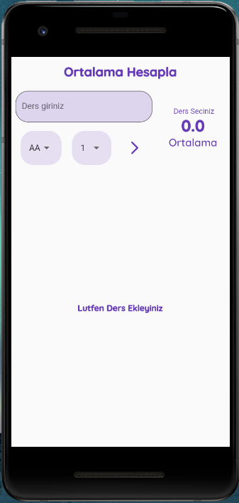
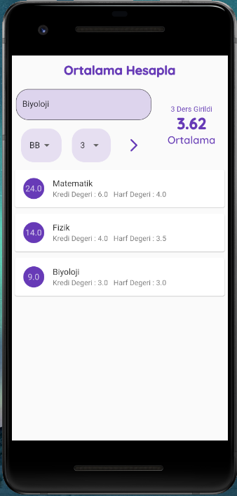
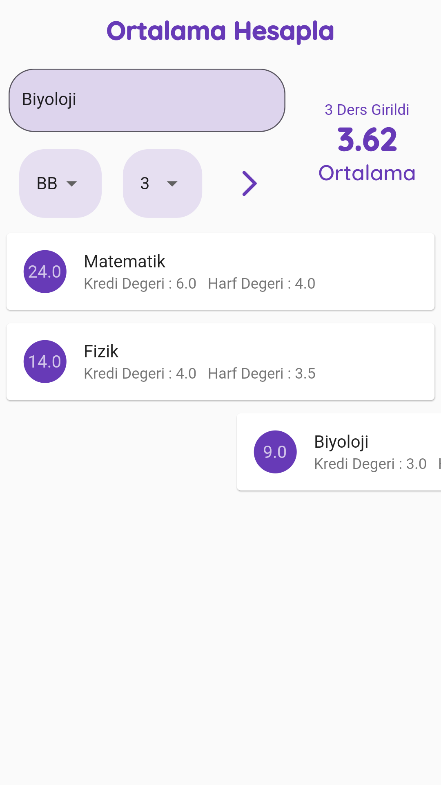

#  AGNO Calculator

<b>AGNO Calculator, Flutter ile yapılmış basit bir agno hesaplama uygulamasıdır.</b>

## Uygulamanın Amacı
Kullanıcıların dönem içinde aldığı derslerin nihai sonuçlarını derslere ait olan Kredi sayısı ve dersten alınan not ile girilip, derslerin ortalamaya nasıl etki ettiğini görmektir.

Eklenen Dersler sağa kaydırılarak (Dismiss edilerek) listeden kaldırılabilir ve güncel ortalamaya ulaşılabilmektedir.

   

## Nasıl Kullanılır?
Ekrandaki form alanındaki gerekli yerlere derslerle ilgili veriler girildikten sonra ok tuşuna basılıp kaydedilir.
Kaydedilen ders aşağıda listenmeyele alınır ve verileri genel verilere dahil edilir.

## Nasıl Kurulur?
👉[APK Dosyası](https://github.com/ahmetmert1/agnocalculator/blob/master/app-release.apk)👈 'na tıklayarak indirimi tamamladıktan sonra telefonunuza kurup uygulamayı kullanabilirsiniz.

 
# 💻 Teknolojiler 
- Dart 
- Flutter 
- VS Code

[Linkedin](https://www.linkedin.com/in/ahmet-mert-öz)

[E-posta](ahmetmertoz11@gmail.com)
